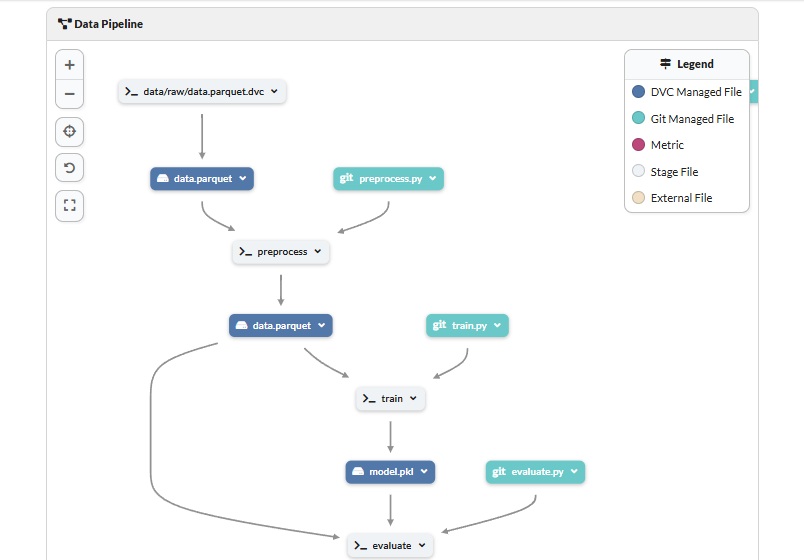
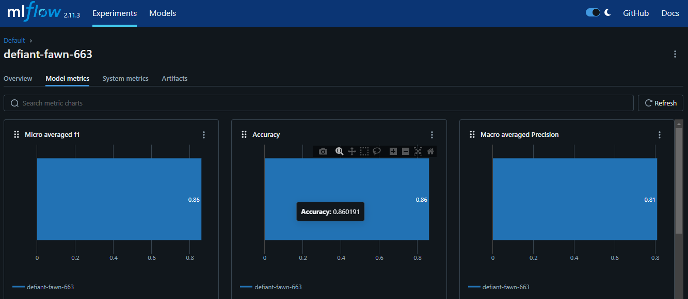

# Consumer Complaints Classification (multiclass) using NLP, DVC, GIT, MLflow and Dagshub

## Table of Content

- [Problem Statement](#problem-statement)
- [Dataset Overview](#dataset-overview)
- [Data pipeline](#data-pipeline)
- [MLflow UI](#mlflow-ui)
- [Project Outcomes](#project-outcomes)
- [Technologies Used](#technologies-used)
- [DVC Staging Commands](#DVC-Staging-Commands)

## Problem Statement

Every consumer care department gets thousands of complaints every day. The department needs to identify the nature of complaints to act on the most important ones first.

This problem aims to identify the category of the complaint filed by the consumer to identify the most important issues to be addressed first. The Product column contains the name of the product where the consumer found issues. So the Product column is the target variable in this classification problem.

## Dataset Overview

Here is a dataset based on consumer complaints collected by Consumer Financial Protection Bureau. Below are all the features in the dataset:

**Date received**: The date on which the complaint received

**Product**: Type of product in which the consumer identified complaint

**Sub-product**: Type of sub-product in which the consumer identified complaint

**Issue**: The issue reported by the consumer

**Sub-issue**: The sub-issue reported by the consumer

**Consumer complaint narrative**: Complete description of the complaint reported by the consumer

## Data pipeline



## MLflow UI



## Project Outcomes

- **Conducted** Exploratory Data Analysis (EDA) and feature engineering on a large dataset of over **3 million records** using **PySpark**.
- **Transformed** large datasets by handling missing values and duplicates in Spark DataFrames, resulting in cleaner data and enhanced model performance.
- Utilized the **NLTK library** for text processing, applying NLP techniques such as stemming and stop word removal to improve feature quality for model building.
- **Achieved** **86% accuracy** on a multiclass classification task using an **SGD Classifier**.
- **Implemented** experiment tracking with **MLflow**, logging model metrics and evaluation results for reproducibility.
- **Automated** the preprocessing, training, and evaluation pipeline with **DVC**, streamlining model development.
- **Utilized** DVC and Git for data and model versioning, ensuring consistency and traceability.
- **Leveraged** **Dagshub** to track MLflow experiments and monitor the **DVC data pipeline**.
- **Established** a **production-level** file structure, including a params.yaml file, to streamline project organization and configuration management.

## Technologies Used

- Python
- Pyspark
- MLFlow
- GIT
- DVC
- Dagshub

## DVC Staging Commands

### Preprocessing pipeline
```sh
dvc stage add -n preprocess \
    -p preprocess.input,preprocess.output \
    -d src/preprocess.py -d data/raw/data.parquet \
    -o data/processed/data.parquet \
    python src/preprocess.py
```
### Training pipeline
```sh
dvc stage add -n train \
    -p train.data,train.model \
    -d src/train.py -d data/processed/data.parquet \
    -o models/model.pkl \
    python src/train.py
```
### Evaluation pipeline
```sh
dvc stage add -n evaluate \
    -d src/evaluate.py -d models/model.pkl -d data/processed/data.parquet \
    python src/evaluate.py
```
